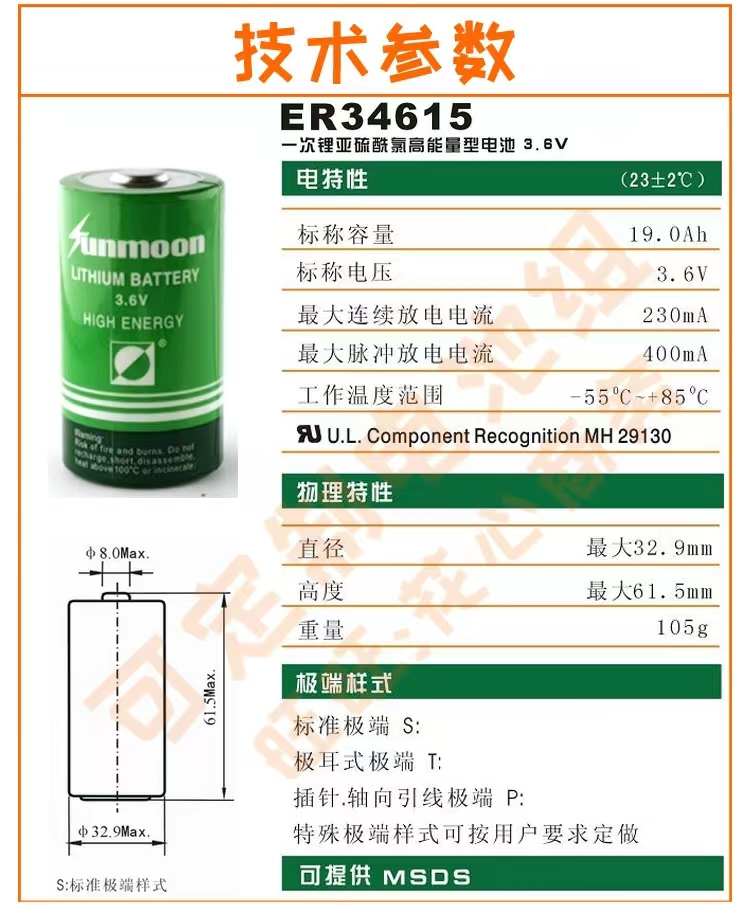

### 功耗测试


- 磁吸开关版

| 测试编号 | 最大电压V | 最小电压V | 最大电流A | 平均电流A | 耗电量mWh | 周期耗时 |
| :------: | :-------: | :-------: | :-------: | :-------: | :-------: | :------: |
|   NO.1   |           |           |           |           |           |          |
|   NO.2   |           |           |           |           |           |          |
|   NO.3   |           |           |           |           |           |          |
|   NO.4   |           |           |           |           |           |          |
|   NO.5   |           |           |           |           |           |          |
|   NO.6   |           |           |           |           |           |          |
|   NO.7   |           |           |           |           |           |          |
|   NO.8   |           |           |           |           |           |          |
|   NO.9   |           |           |           |           |           |          |
|  NO.10   |           |           |           |           |           |          |
|  NO.11   |           |           |           |           |           |          |
|  NO.12   |           |           |           |           |           |          |
|  NO.13   |           |           |           |           |           |          |
|  NO.14   |           |           |           |           |           |          |
|  NO.15   |           |           |           |           |           |          |
|   AVG    |           |           |           |           |           |          |


- 角度开关版

| 测试编号 | 最大电压V | 最小电压V | 最大电流A | 平均电流A | 耗电量mWh | 周期耗时 |
| :------: | :-------: | :-------: | :-------: | :-------: | :-------: | :------: |
|   NO.1   |           |           |           |           |           |          |
|   NO.2   |           |           |           |           |           |          |
|   NO.3   |           |           |           |           |           |          |
|   NO.4   |           |           |           |           |           |          |
|   NO.5   |           |           |           |           |           |          |
|   NO.6   |           |           |           |           |           |          |
|   NO.7   |           |           |           |           |           |          |
|   NO.8   |           |           |           |           |           |          |
|   NO.9   |           |           |           |           |           |          |
|  NO.10   |           |           |           |           |           |          |
|  NO.11   |           |           |           |           |           |          |
|  NO.12   |           |           |           |           |           |          |
|  NO.13   |           |           |           |           |           |          |
|  NO.14   |           |           |           |           |           |          |
|  NO.15   |           |           |           |           |           |          |
|   AVG    |           |           |           |           |           |          |


### unmoon 电池使用年限计算

- 电池参数：ER34615

  

  

- 使用 mWh 进行转化 （不考虑防钝化、电池自放电的情况下）

```rust
// 电池容量转化
// 真实容量14500mAh
3.6V * 14500mAh = 52200 mWh


// 额定容量 与 单次平均耗电量 转换
1. 磁吸开关
能上报数据次数 52200 / 1.35082 = 38643 次
一次2小时计算最大使用时长 38643/ 12 =  3220 天 
转化成年限 3220 /365 = 8.8 年

2. 角度开关
能上报数据次数 52200 / 1.594793 = 32731 次
一次2小时计算最大使用时长 32731 /12 = 2727 天
转化为年限 2727 /365 = 7.47 年


// 使用19000mAh计算
3.6 * 19000mAh = 68400 mWh
1. 磁吸开关 
上报次数： 50635 次
天数：4219 天
年限：11.5 年

2. 角度开关
上报次数： 42889 次
天数：3574 天
年限：9.79 年

注释：角度开关由于比较灵敏，因此上报周期可能会更为缩短。实际使用情况无以言表。

```


